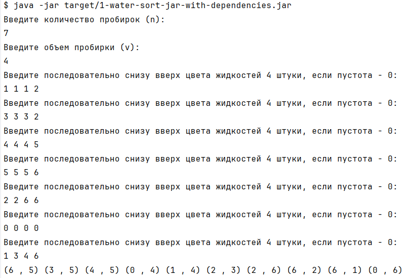

# Water sort
Написан алгоритм для решения задач типа "Water sort".

# Проверка
Для проверки использовались сложные уровни из игры с сайта [Сссылка](https://yandex.ru/games/app/231397?utm_source=game_header_logo#app-id=231397&catalog-session-uid=catalog-430e8e36-33e0-550b-aa3f-b6dff9fe857b-1749878734635-a5d1&rtx-reqid=9147885116468428321&pos=%7B%22listType%22%3A%22played%22%2C%22tabCategory%22%3A%22common%22%7D&redir-data=%7B%22block%22%3A%22played%22%2C%22block_index%22%3A0%2C%22card%22%3A%22your_games%22%2C%22carousel_size%22%3A%221.88%22%2C%22col%22%3A1%2C%22first_screen%22%3A1%2C%22page%22%3A%22main%22%2C%22rn%22%3A251058215%2C%22row%22%3A0%2C%22rtx_reqid%22%3A%229147885116468428321%22%2C%22same_block_index%22%3A0%2C%22wrapper%22%3A%22played_games%22%2C%22games_request_id%22%3A%221749878734283707-533979887943242057-balancer-l7leveler-kubr-yp-klg-92-BAL%22%2C%22http_ref%22%3A%22https%253A%252F%252Fyandex.ru%252Fgames%252F%22%7D)

# Запуск
1. mvn clean package
2. java -jar target/1-water-sort-jar-with-dependencies.jar 

# Ввод данных
После запуска необходимо ввести следующие значения:
- n - общее количество пробирок (включая пустые)
- v - количество слоев в одной пробирке
- поэтапно заполнить n пробирок:
  - для каждой пробирки вводятся v чисел - цвета слоев

# Результат
В результате выводится поэтапные шаги, которые нужно выполнить для решения задачи.

# Пример
1. Решаем задание 
2. Нумеруем слои 
3. Запускаем jar
4. Вводим нужные данные и получаем решение 
5. Проходим по шагам (скрин сделан перед последним шагом) 
6. Готово

**Примечание:** алгоритм иногда предлагает не прям оптимальные решения, 1-2 лишних шага, но к решению приводит. Есть куда стремиться)